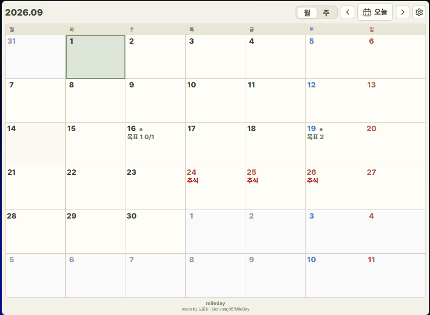
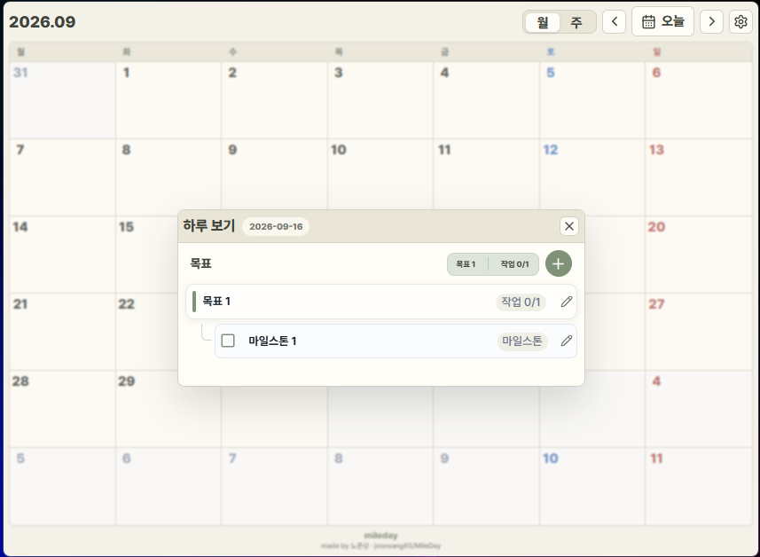
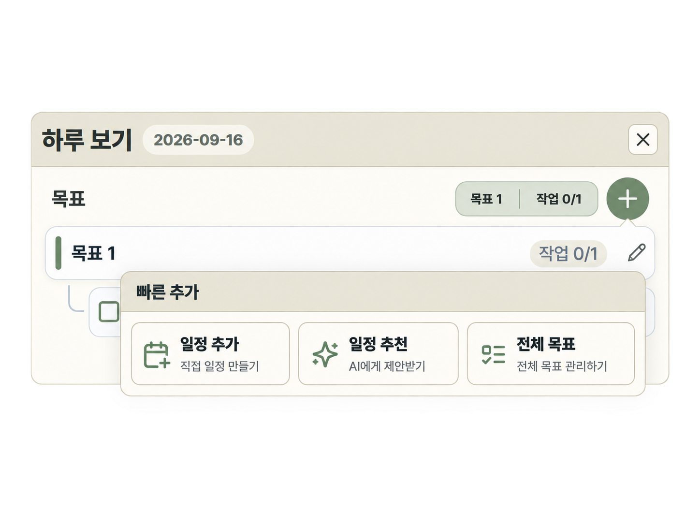
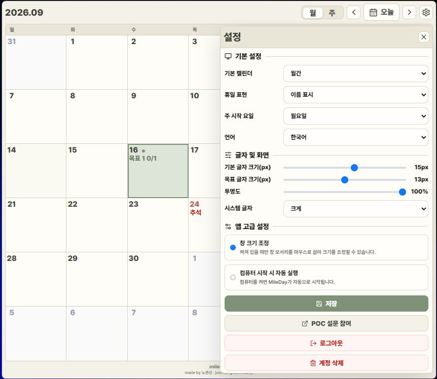
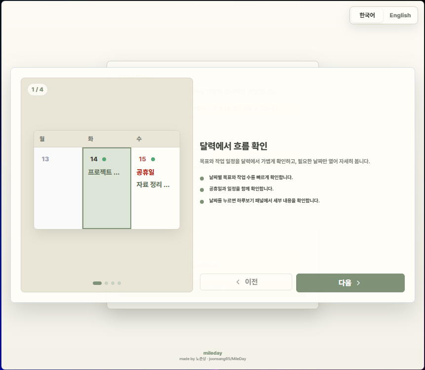
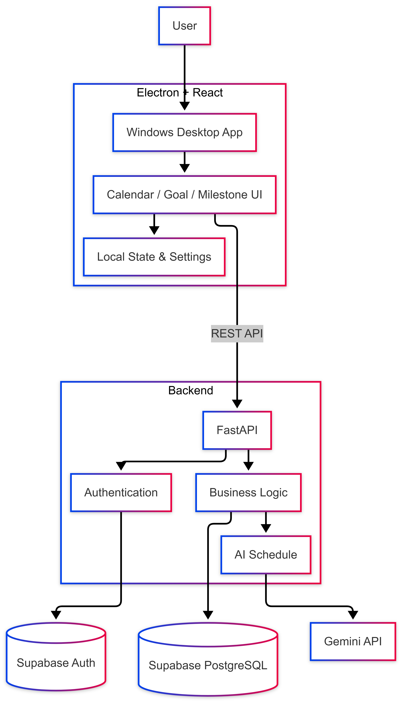
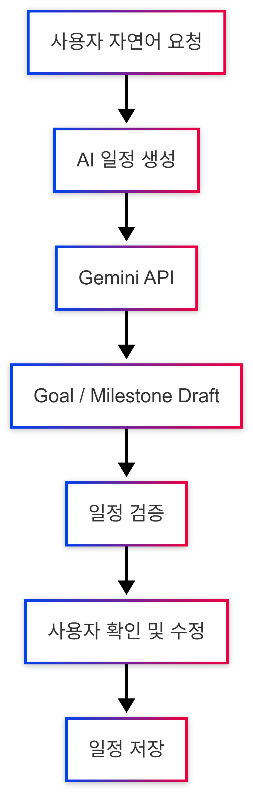

<div align="center">

# MileDay 🌿

### 목표를 작은 마일스톤으로 나누고,

### 매일의 일정으로 이어주는 Windows 데스크톱 플래너

<p align="center">
  
</p>

---

## ✨ Preview

<p align="center">
  
  
</p>

<p align="center">
  <sub>
    하루 보기 · 빠른 추가 및 AI 일정 추천
  </sub>
</p>

<br/>

**Goal → Milestone → Calendar → Today**

목표를 세우는 것에서 끝나지 않고,
실제로 실행할 수 있는 일정으로 만들어주는 데스크톱 위젯 앱입니다.

<br/>

`Windows` · `Electron` · `React` · `FastAPI` · `Supabase` · `Gemini`

</div>

---

## ✨ About MileDay

큰 목표를 세웠지만,

> “그래서 오늘은 뭘 해야 하지?”

라는 생각이 들 때가 있습니다.

MileDay는 하나의 목표를 여러 개의 **마일스톤**으로 나누고,
각 마일스톤을 실제 캘린더의 날짜에 배치해서 실행할 수 있도록 만든 플래너입니다.

평소에는 바탕화면 위젯처럼 두고 사용하면서
오늘 해야 할 일과 앞으로의 일정을 빠르게 확인할 수 있습니다.

---

## 🌱 주요 기능

### 🎯 Goal & Milestone

목표와 마감일을 만들고,
목표를 달성하기 위한 세부 작업을 마일스톤으로 관리할 수 있습니다.

```text
AI Engineer Portfolio 완성
│
├─ 프로젝트 정리
├─ README 작성
├─ 포트폴리오 수정
└─ 최종 검토
```

각 마일스톤에는 날짜를 지정할 수 있으며
완료 여부도 바로 변경할 수 있습니다.

---

### 📅 Calendar

월간 캘린더에서 목표와 마일스톤 일정을 확인할 수 있습니다.

날짜를 선택하면 해당 날짜의 작업을 바로 확인하고
수정하거나 완료할 수 있습니다.

---

### ☀️ Today View

오늘 해야 할 마일스톤을 따로 모아서 보여줍니다.

캘린더 전체를 탐색하지 않아도
현재 해야 할 작업에 집중할 수 있도록 구성했습니다.

---

### ✨ AI Schedule

하고 싶은 일을 자연어로 입력하면
MileDay가 목표와 마일스톤 일정 초안을 만들어줍니다.

예를 들어,

> 9월 말까지 AI 엔지니어 포트폴리오를 완성하고 싶어.
> 너무 빡빡하지 않게 일정을 나눠줘.

라고 입력하면,

```text
AI Engineer Portfolio 완성

09/05  프로젝트 정리
09/10  핵심 경험 선별
09/17  포트폴리오 초안 작성
09/24  디자인 및 내용 수정
09/29  최종 검토
```

처럼 편집 가능한 일정 초안을 생성합니다.

AI가 만든 일정은 바로 저장되지 않습니다.

```text
사용자 요청
    ↓
AI 일정 초안 생성
    ↓
날짜 / 마감일 / 중복 일정 검증
    ↓
사용자 확인 및 수정
    ↓
일정 저장
```

사용자가 최종 내용을 확인한 뒤 저장하도록 구성했습니다.

---

## 🖥️ Desktop Widget

MileDay는 브라우저 서비스가 아니라
Windows에서 실행되는 데스크톱 위젯 애플리케이션입니다.

<p align="center">
  
</p>

- 창 크기 및 위치 조정
- 글자 크기 설정
- 투명도 설정
- Windows 시작 시 자동 실행
- 로그인 상태 유지
- 
---

## 🚀 Download

### Windows

MileDay는 Windows용 애플리케이션으로 배포됩니다.

GitHub의 Releases 페이지에서 최신 버전을 다운로드할 수 있습니다.

mileday-vx.x.x.exe

설치 파일을 실행한 뒤 안내에 따라 설치하면 됩니다.

현재 MileDay는 Windows 환경을 우선 지원합니다.

---

## 🌱 Getting Started

처음 사용하는 사용자도 주요 기능을 바로 이해할 수 있도록
간단한 온보딩 가이드를 제공합니다.

<p align="center">
  
</p>

---

## 🏗️ Architecture

<p align="center">
  
</p>

MileDay는 Electron 기반 데스크톱 앱과 FastAPI 백엔드를 분리하고,  
인증과 데이터 처리는 Supabase를 통해 관리합니다.

AI 일정 생성도 백엔드 내부 기능으로 분리해  
일반 일정 관리 기능과 같은 API 흐름 안에서 동작하도록 구성했습니다.

### AI Schedule Flow

<p align="center">
  
</p>

AI는 사용자의 요청을 바탕으로 목표와 마일스톤 초안을 생성합니다.

생성된 결과는 바로 DB에 저장하지 않고,  
일정 검증과 사용자 확인을 거친 뒤 실제 일정에 반영합니다.

---

## 🧠 AI Design

MileDay의 AI 기능은 단순히 LLM 응답을 화면에 보여주는 방식으로 만들지 않았습니다.

초기 개발 과정에서는 여러 로컬 SLM을 비교하면서

* 한국어 지시 수행 능력
* 구조화 출력 안정성
* Parser Error
* Inference Latency
* TTFT
* Tokens/sec

등을 함께 평가했습니다.

실험 과정에서 모델에게 너무 많은 책임을 주면

```text
잘못된 날짜 생성
DB Field 생성
JSON 구조 오류
기존 일정 훼손
```

같은 문제가 발생할 수 있다는 것을 확인했습니다.

그래서 현재 구조에서는 역할을 분리했습니다.

```text
AI
 └─ 사용자의 의도 이해
 └─ 목표 / 마일스톤 초안 생성

Application
 └─ 날짜 검증
 └─ 마감일 검증
 └─ 중복 검증
 └─ DB Payload 생성
 └─ 실제 저장
```

**AI의 유연성과 Application Logic의 안정성을 분리하는 것**을 핵심 원칙으로 사용하고 있습니다.

AI 기능의 현재 책임 경계는 [`docs/ai.md`](docs/ai.md)에서 확인할 수 있습니다.

---

## ⚡ Performance

사용자 테스트 전 실제 사용 흐름을 기준으로 성능 개선을 진행했습니다.

|           |  Before |     After |
| --------- | ------: | --------: |
| E2E 성공률   |   91.2% | **99.2%** |
| API 호출 수  |     823 |   **246** |
| API 5xx   |   4.37% | **0.41%** |
| 목표 생성 P95 | 4,965ms | **839ms** |
| 완료 토글 P95 | 8,029ms |  **65ms** |
| 날짜 선택 P95 | 4,894ms |  **97ms** |

주요 개선 사항:

`Optimistic UI` · `Client Cache` · `API 호출 최적화` · `Auth Retry` · `Fallback`

자세한 내용은 [`docs/changelog.md`](docs/changelog.md)에서 확인할 수 있습니다.

---

## 🛠 Tech Stack

<div align="center">

| Category       | Stack                                               |
| -------------- | --------------------------------------------------- |
| Desktop        | Electron                                            |
| Frontend       | React · TypeScript · Zustand · Vite                 |
| Backend        | Python · FastAPI · Pydantic                         |
| Database       | Supabase PostgreSQL                                 |
| Authentication | Supabase Auth                                       |
| AI             | Gemini API · Structured Output · Prompt Engineering |
| Test           | Pytest · Vitest · Playwright                        |
| Distribution   | electron-builder · NSIS                             |

</div>

---

## 📂 Project Structure

```text
MileDay
│
├─ frontend
│  ├─ electron
│  └─ src
│
├─ backend
│  └─ app
│     ├─ api
│     ├─ services
│     ├─ repositories
│     └─ infrastructure
│
├─ supabase
├─ tests
├─ scripts
└─ docs
```

각 영역에 대한 자세한 설명은 아래 문서를 참고할 수 있습니다.

* [Frontend](frontend/README.md)
* [Backend](backend/README.md)
* [Project Docs](docs/README.md)

---

## 📚 Documentation

개발 과정에서 발생한 결정과 실험 결과를 문서로 기록하고 있습니다.

| Document | Description |
| --- | --- |
| [Product](docs/product.md) | 제품 목표와 범위 |
| [Architecture](docs/architecture.md) | 시스템 구조와 저장소 |
| [API](docs/api.md) | REST API endpoint |
| [AI](docs/ai.md) | AI 일정 초안 책임 경계 |
| [Operations](docs/operations.md) | 실행, 테스트, 문제 해결 |
| [Changelog](docs/changelog.md) | 변경 이력과 성능 개선 |

---

## 💻 Development

### Requirements

```text
Node.js 18+
Python 3.11+
Supabase Project
Gemini API Key (AI 기능 사용 시)
```

### Run

```bash
.\dev.cmd
```

또는

```powershell
powershell -ExecutionPolicy Bypass -File .\scripts\dev.ps1
```

Backend:

```bash
uvicorn backend.app.main:app --host 127.0.0.1 --port 8000 --reload
```

Frontend:

```bash
cd frontend

npm install
npm run dev
```

---

## 🧪 Test

Backend

```bash
pytest
```

Frontend

```bash
cd frontend
npm test
```

Build

```bash
npm run build
```

현재 검증 기준:

```text
Backend   99 passed
Coverage  94.33%

Frontend  37 passed

E2E       99.2%
```

---

<div align="center">

### MileDay

**Turn goals into days.**

목표를 세우는 것에서
오늘 실행하는 것까지.

</div>
