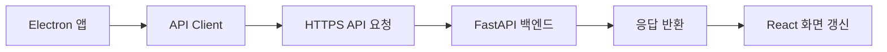
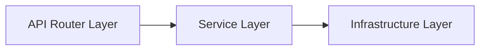
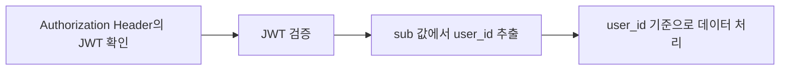

# MileDay - 서비스 구조도 시각화 / 아키텍처 설명

## 문서 메타데이터

- Notion 페이지: 서비스 구조도 시각화
- 마일스톤: M0.계획하기
- 상태: 완료
- 스코프: 구조 정의
- 타입: DESIGN
- 기준 시점: 2026-07-01

## 1. 사용자가 PC에서 앱에 접근하는 과정

MileDay는 일반 웹사이트처럼 브라우저에서 접속하는 방식이 아니다.
사용자의 컴퓨터에서 직접 실행되는 Electron 기반 데스크톱 앱이므로, PC에 설치된 MileDay.exe를 실행하여 앱에 접근한다.

### 사용자 접근 흐름


앱은 위젯형 플래너를 목표로 하므로, 사용자는 별도 브라우저를 열지 않아도 바탕화면에서 앱을 확인할 수 있다.
사용자가 앱을 실행하면 Electron이 데스크톱 창을 생성하고, 그 안에서 React Renderer가 실제 UI를 렌더링한다.

### 주요 사용자 동작

- 로그인 또는 회원가입
- 월간 캘린더 확인
- 오늘 할 일 확인
- 목표 생성 및 수정
- 마일스톤 생성 및 완료 처리
- 날짜 선택 후 해당 날짜의 일정 확인
- 위젯 창 위치 및 크기 조정

## 2. PC에서의 동작 과정

사용자 PC에서는 Electron 앱이 실행되며, Main Process, Preload Script, React Renderer가 역할을 나누어 동작한다.

### 2.1 Main Process

Electron 앱의 데스크톱 창과 운영체제 관련 기능을 관리한다.

- 앱 창 생성
- 창 크기 조정
- 창 위치 저장
- 마지막 실행 위치 복원
- Windows 시작 시 자동 실행 설정
- 로컬 위젯 설정 관리

Main Process는 Windows 데스크톱 앱으로서의 실행 환경과 창 동작을 제어한다.

### 2.2 Preload Script

Electron의 Main Process와 React Renderer 사이를 안전하게 연결하는 계층이다.

React Renderer가 운영체제 기능에 직접 접근하면 보안상 위험할 수 있으므로, Preload Script를 통해 필요한 기능만 제한적으로 연결한다.

- 창 위치 저장 요청
- 창 크기 저장 요청
- 자동 실행 설정 변경 요청
- 로컬 설정 읽기

Preload Script는 React 화면과 Electron 기능 사이의 안전한 IPC 연결 통로이다.

### 2.3 React Renderer

사용자가 실제로 보는 화면을 담당한다.

| 구성 요소 | 역할 |
|---|---|
| UI 컴포넌트 | 캘린더, Today List, 목표 폼, 마일스톤 폼, 설정 화면 표시 |
| Zustand Store | 선택 날짜, 현재 월, 로그인 사용자, 위젯 설정 등 전역 상태 관리 |
| API Client | FastAPI 백엔드에 API 요청 전송 |
| Date Utility | date-fns를 사용해 날짜 계산 및 포맷 처리 |

React Renderer는 사용자의 입력을 받고, 필요한 경우 API Client를 통해 FastAPI 서버에 요청을 전달한다.

### 목표 생성 로직 예시


핵심 원칙은 프론트엔드가 Supabase에 직접 접근하지 않는 것이다.
모든 데이터 요청은 FastAPI 백엔드를 통해 처리하여 FE와 BE를 명확히 구분한다.

## 3. 앱에서 클라우드 서버에 접근하는 방법

사용자 PC에서 실행되지만, 목표와 마일스톤 데이터는 로컬에만 저장하지 않고 클라우드 기반 백엔드를 통해 관리한다.

프론트엔드는 FastAPI 백엔드의 API 주소를 환경 변수로 관리한다.

```env
VITE_API_BASE_URL=https://api.mileday.com
```

개발 중에는 로컬 서버를 사용하여 빠른 테스트를 진행한다.

```env
VITE_API_BASE_URL=http://localhost:8000
```

배포 이후에는 외부 서버 주소로 변경하여 always-on으로 동작한다.

```env
VITE_API_BASE_URL=https://api.mileday.com
```

개발 단계와 운영 단계에서 코드를 크게 수정하지 않고, 환경 변수만 변경하여 서버 연결 대상을 바꾸기 위함이다.

### API 요청 방식

앱에서 서버로 요청을 보낼 때는 HTTP 또는 HTTPS 기반 API 요청을 사용한다.
로그인 이후에는 Supabase Auth에서 발급받은 JWT를 요청 헤더에 포함한다.

```http
Authorization: Bearer <access_token>
```

### 기본 요청 흐름



### 예시 API 요청

| 사용자 동작 | API 요청 |
|---|---|
| 로그인 | POST /auth/login |
| 목표 목록 조회 | GET /goals |
| 목표 생성 | POST /goals |
| 마일스톤 생성 | POST /goals/{goal_id}/milestones |
| 오늘 할 일 조회 | GET /milestones/today |
| 날짜 상세 조회 | GET /calendar/date/{date} |

FE는 API 응답을 받아 화면 상태를 갱신하고, 사용자는 결과를 위젯 화면에서 확인한다.

## 4. 서버 동작 과정

서버는 Cloud 또는 VPS 환경에서 실행되는 FastAPI 백엔드로 구성한다.
FastAPI 서버는 프론트엔드 요청을 받아 인증, 권한 검증, 비즈니스 로직 처리, DB 접근, 로그 기록을 담당한다.

### 서버 내부 계층



### 4.1 API Router Layer

Router Layer는 프론트엔드에서 들어온 API 요청을 기능별로 분리한다.

| Router | 담당 기능 |
|---|---|
| Auth Router | 회원가입, 로그인, 현재 사용자 확인 |
| Goal Router | 목표 생성, 조회, 수정, 삭제 |
| Milestone Router | 마일스톤 생성, 조회, 수정, 삭제, 완료 처리 |
| Calendar Router | 날짜별 상세 조회, Today List 조회 |

Router는 요청을 직접 처리하는 것이 아니라 요청 값을 검증한 뒤 Service Layer로 전달한다.

### 4.2 Service Layer

Service Layer는 실제 비즈니스 로직을 처리한다.

| Service | 담당 기능 |
|---|---|
| Auth Service | 로그인 처리, JWT 검증, 현재 사용자 추출 |
| Goal Service | 목표 CRUD, 반복 목표 기본 로직 |
| Milestone Service | 마일스톤 CRUD, 완료 여부 변경 |
| Calendar Service | 날짜별 목표/마일스톤 조회, 오늘 할 일 조회 |

### 목표 생성 요청 처리 예시


### 4.3 Infrastructure Layer

Infrastructure Layer는 외부 서비스나 서버 설정과의 연결을 담당한다.

| 구성 요소 | 역할 |
|---|---|
| Supabase Client | Supabase Auth 및 PostgreSQL 요청 처리 |
| Logging Module | API 에러 로그와 서버 실행 로그 기록 |
| Config Module | 환경 변수, CORS, API 설정 관리 |

이 계층을 분리하는 이유는 FastAPI의 핵심 로직과 외부 연결 코드를 분리해서 결합도를 낮추기 위함이다.

### 4.4 에러 로그 처리

서버에서 오류가 발생하면 Logging Module을 통해 로그를 남긴다.

- 로그인 실패
- JWT 검증 실패
- 권한 없는 데이터 접근 시도
- 목표 생성 실패
- 마일스톤 수정 실패
- Supabase 연결 오류
- 예상하지 못한 서버 오류

FE에는 사용자가 이해할 수 있는 메시지를 반환하고, 자세한 원인은 백엔드 로그에서 확인할 수 있도록 설계한다.

```text
사용자에게 표시:
"목표를 생성하지 못했습니다."

백엔드 로그:
[GOAL_CREATE_ERROR] user_id=... error=...
```

## 5. 서버에서 DB에 접근하는 방법

FastAPI 서버는 Supabase Client를 통해 Supabase Auth와 Supabase PostgreSQL에 접근한다.
FE가 Supabase에 직접 접근하지 않고 반드시 BE를 거치도록 설계한다.

이를 통해 인증 검증, 사용자 권한 확인, 비즈니스 로직 처리를 FastAPI에서 통제하고, DB 레벨에서는 RLS를 통해 사용자별 접근을 한 번 더 제한한다.

### 기본 DB 접근 흐름


### 인증 처리

로그인 시 FastAPI가 Supabase Auth에 로그인 요청을 전송한다.


로그인 이후 요청에서는 JWT를 검증하여 사용자 ID를 확인한다.



FastAPI는 Supabase Auth에서 발급한 JWT를 검증하고, JWT의 sub 값을 현재 사용자의 user_id로 사용한다.
이후 목표, 마일스톤, 사용자 설정 데이터는 모두 해당 user_id를 기준으로 처리한다.

### 데이터 접근 처리

목표, 마일스톤, 사용자 설정 데이터는 Supabase PostgreSQL에 저장한다.
서버는 데이터 CRUD 시 항상 user_id를 기준으로 처리한다.

```text
goals.user_id = current_user.id
milestones.user_id = current_user.id
user_settings.user_id = current_user.id
```

이를 통해 사용자는 본인이 생성한 데이터만 조회 가능하다.
목표 데이터는 goals 테이블에 저장하고, 목표 하위의 세부 작업은 milestones 테이블에 저장한다.
마일스톤은 특정 목표에 속하므로 goal_id를 통해 목표와 연결하고, 사용자별 접근 제한을 위해 user_id도 함께 저장한다.
사용자 설정 값 중 계정 기준으로 유지되어야 하는 값은 user_settings 테이블에 저장한다.

### 로컬 설정 처리

창 위치, 창 크기, 투명도, 항상 위 표시 여부, Windows 시작 시 자동 실행 여부처럼 현재 PC 환경에 종속되는 값은 DB에 저장하지 않는다.
해당 값은 Electron 앱 내부의 로컬 저장소에 저장한다.

```text
window_x
window_y
window_width
window_height
always_on_top
opacity
launch_on_startup
last_selected_date
last_opened_month
sidebar_collapsed
widget_layout
```

로컬 저장 값은 로그인 계정이 아니라 현재 PC 환경에 종속되는 값이므로, 다른 PC로 자동 동기화되지 않아도 되는 설정을 중심으로 관리한다.

### 외부 캘린더 연동 처리

외부 캘린더 연동은 초기 MVP 범위에서는 제외하고 M8.Future 기능으로 분리한다.
향후 외부 캘린더 연동이 추가될 경우, 연동 정보는 external_calendar_connections 테이블에서 관리한다.

```text
external_calendar_connections.user_id = current_user.id
```

외부 캘린더 연동 정보도 사용자별로 분리되어야 하므로 user_id를 기준으로 접근을 제한한다.
단, access_token, refresh_token 같은 민감한 인증 정보는 일반 설정값처럼 저장하지 않고, 실제 구현 시 암호화 저장 또는 별도 보안 저장 방식을 검토한다.

### RLS 적용

Supabase PostgreSQL에는 RLS를 적용하여 DB 레벨에서도 사용자별 접근을 제한한다.

```text
auth.uid() = user_id
```

로그인한 사용자의 ID와 각 테이블의 user_id가 일치할 때만 CRUD 동작이 가능하도록 설정한다.

RLS는 다음 테이블에 적용한다.

```text
goals
milestones
user_settings
external_calendar_connections
```

FastAPI에서도 JWT를 검증하고 user_id를 기준으로 데이터를 처리하지만, DB 레벨에서도 RLS를 적용하여 이중으로 보호한다.

## 6. MVP 이후 작업 / 향후 확장

MVP에서는 목표와 마일스톤을 사용자가 직접 생성하고 관리하는 기능에 집중한다.
다만 구조상 향후 기능을 확장할 수 있도록 설계한다.

### 6.1 외부 캘린더 연동

향후 MileDay의 목표와 마일스톤을 외부 캘린더와 연동할 수 있도록 확장한다.

| 외부 서비스 | 연동 방향 |
|---|---|
| Google Calendar | Google Calendar API를 통한 일정 동기화 |
| Apple / iOS Calendar | iCloud, CalDAV, ICS 방식 검토 |
| Galaxy / Samsung Calendar | Android Calendar Provider 또는 Google 계정 동기화 방식 검토 |

초기에는 양방향 동기화보다, MileDay에서 외부 캘린더로 내보내는 단방향 연동부터 검토한다.

향후 외부 캘린더 연동을 위해 다음 필드를 추가할 수 있다.

```text
external_provider
external_event_id
sync_status
last_synced_at
```

### 6.2 AI 일정 도우미

AI 기능도 도입 가능하다.

예상 기능은 다음과 같다.

- 자연어 기반 일정 수정
- 목표 입력 시 AI 마일스톤 후보 생성
- 미완료 작업 자동 리스케줄링
- 마감일 기반 일정 재배치 제안

예를 들어 사용자가 다음과 같이 입력할 수 있다.

```text
난 러닝을 계획적으로 하고 싶어. 격일로 하면 좋을 것 같고, 수요일, 금요일은 일정이 있어서 그 때는 못 해
```

AI 일정 도우미가 해당 반복 일정을 세울 때 특정 요일을 제외하는 방식으로 확장할 수 있다.
다만 AI 기능은 MVP의 핵심 범위가 아니므로, 초기 구현에서는 제외한다.
현재 구조에서는 FastAPI 백엔드에 AI 모듈을 추가하는 방식으로 확장할 수 있도록 설계한다.

### 6.3 위젯 기능 고도화

MVP 이후에는 위젯 동작과 UI 커스터마이징 기능을 확장한다.

예상 기능은 다음과 같다.

- 투명도 조절
- 항상 위 토글
- 듀얼 모니터 위치 복원
- 글꼴 및 UI 스타일 설정
- 목표 또는 마일스톤별 색상 지정
- 공휴일 주말 처리
- 반복 일정 예외 처리 UI

반복 일정 예외 처리와 색상 필드는 나중에 추가하면 데이터 구조 변경 비용이 커질 수 있으므로, 초기 설계 단계에서 확장 가능성을 고려해야 한다.

### 6.4 모바일 앱 연동

추후에는 데스크톱 앱과 연동되는 모바일 앱도 고려할 수 있다.
최근 캘린더 앱은 모바일과 연동되는 경우가 많아 이를 고려해야 사용자 수를 확보할 수 있을 것으로 예상된다.
모바일 앱은 기존 Supabase DB와 FastAPI API를 재사용할 수 있다.
따라서 현재 구조에서 모바일 앱을 추가하더라도 데이터 처리 구조를 크게 변경하지 않아도 된다.
