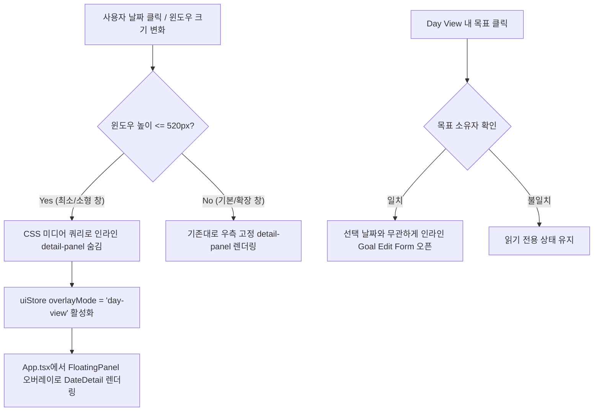

# ADR 0015: 목표 날짜별 편집 확장 및 최소 창 Day View 레이아웃 개선

- 날짜: 2026-08-17
- 상태: Accepted
- 관련 영역: Frontend (React / Zustand / CSS / Layout)
- 관련 파일:
  - `frontend/src/components/DateDetail.tsx`
  - `frontend/src/components/DateDetail.test.tsx`
  - `frontend/src/App.tsx`
  - `frontend/src/store/uiStore.ts`
  - `frontend/src/styles.css`

---

## 1. 배경 (Context & Problem Statement)

MileDay는 사용자의 Windows 바탕화면에 상시 상주하는 **데스크톱 캘린더 위젯**이다. 따라서 초소형 윈도우 크기부터 확장된 데스크톱 크기까지 모든 해상도에서 핵심 정보인 월간 캘린더와 일간 상세 일정(Day View)이 매끄럽게 상호작용해야 한다.

그러나 실제 사용성과 초기 POC 테스트 과정에서 다음과 같은 두 가지 심각한 UX/레이아웃 결함이 발견되었다.

### 문제 1: 목표(Goal) 편집 진입점의 날짜 종속성
- **증상**: 목표는 시작일부터 마감일까지 여러 날짜에 걸쳐 캘린더 및 일간 상세(`DateDetail`)에 노출된다. 그러나 기존 구현에서는 목표를 처음 생성한 특정 날짜(`goal.created_at`)에서만 인라인 편집 폼이 활성화되었다.
- **사용자 경험 문제**: 사용자가 마감일이나 특정 마일스톤이 배치된 날짜의 Day View에서 목표 카드/제목을 클릭했을 때 편집 폼이 열리지 않아, 목표를 언제 생성했는지 기억해 해당 날짜로 돌아가야만 수정할 수 있는 심각한 사용성 저하가 발생했다.

### 문제 2: 초소형 위젯 창(최소 해상도)에서의 화면 과점유
- **증상**: MileDay의 기본 최소 윈도우 크기는 `520px x 380px`이다. 기존 레이아웃은 `planner-workspace` 내에서 좌측 캘린더 격자와 우측 `DateDetail` 패널을 2컬럼 고정 분할로 렌더링했다.
- **레이아웃 깨짐**: 창 높이가 380~520px로 작아지면 우측 `DateDetail` 패널이 전체 화면의 50% 이상을 차지하면서, 좌측 캘린더의 6주 격자가 지나치게 압축되어 날짜 셀 텍스트가 겹치거나 마일스톤 뱃지가 잘려 나가는 현상이 발생했다.

---

## 2. 원인 분석 (Deep Dive Analysis)

### 2.1 목표 편집 권한 검증 로직의 오류
`DateDetail.tsx` 내부에서 목표 수정 폼을 열기 위한 조건식이 다음과 같이 '선택된 날짜'와 '생성일자'의 문자열 일치 여부에 의존하고 있었다.

```typescript
// [기존 코드의 문제점]
const canEditGoal = isSelectedDateSameAs(goal.created_at);
// -> 목표가 유효하게 표시되는 날짜임에도 생성일과 다르면 수정 불가
```

목표는 본질적으로 사용자(`user_id`) 소유의 엔티티이며, 캘린더 조회 계약 상 해당 날짜의 스코프에 포함되어 내려온 목표라면 어느 날짜에서든 수정할 수 있어야 한다.

### 2.2 고정 분할 그리드의 반응형 한계
`styles.css`에서 `planner-workspace`가 `grid-template-columns: minmax(0, 1.4fr) minmax(260px, 1fr)` 형태로 구성되어 있어, 윈도우 폭과 높이가 최소치(`520px x 380px`)일 때도 항상 `detail-panel`이 공간을 강제 점유하고 있었다.

---

## 3. 해결 방향 및 아키텍처 결정 (Architecture Decisions)



### 결정 1: 목표 소유권 기반의 편집 권한 분리
1. 목표 편집 가능 여부를 날짜 비교에서 **목표 엔티티 소유권(`user_id === current_user.id`)** 기준으로 전환한다.
2. `DateDetail.tsx`에서 목표 클릭 시 해당 날짜의 컨텍스트를 유지하면서 목표의 제목(`title`), 마감일(`deadline`), 색상(`color`)을 즉시 수정할 수 있도록 인라인 편집 상태(`editingGoalId`)를 독립적으로 관리한다.

### 결정 2: 반응형 플로팅 오버레이(FloatingPanel) 도입
1. **CSS 미디어 쿼리 분기**: `@media (max-height: 520px)` 조건에서 `.planner-workspace .detail-panel`을 `display: none`으로 숨겨, 최소 창에서는 캘린더 격자가 100% 가로/세로 영역을 온전히 사용할 수 있도록 보장한다.
2. **Zustand 오버레이 모드 확장**: `uiStore.ts`의 `OverlayMode` 타입에 `"day-view"`를 추가한다.
3. **조건부 모달 렌더링**: 소형 창(`window.innerHeight <= 520`)에서 사용자가 날짜를 클릭하면 우측 고정 패널 대신 `FloatingPanel`을 통해 `DateDetail` 컴포넌트가 캘린더 위에 부유하는 오버레이 형태로 렌더링되도록 한다.

---

## 4. 상세 구현 내용 (Implementation Details)

### 4.1 `DateDetail.tsx`의 목표 편집 핸들러 개선
날짜 일치 검사를 제거하고, 인라인 편집 폼의 저장/취소/삭제 라이프사이클을 매끄럽게 연결했다.

```typescript
// frontend/src/components/DateDetail.tsx
export function DateDetail({
  date,
  goals,
  milestones,
  onUpdateGoal,
  onDeleteGoal,
  // ...
}: DateDetailProps) {
  const [editingGoalId, setEditingGoalId] = useState<string | null>(null);

  // 목표 클릭 시 어느 날짜에서든 편집 모드 진입
  function handleGoalClick(goal: Goal) {
    setEditingGoalId(goal.id);
    setGoalTitle(goal.title);
    setGoalDeadline(goal.deadline);
    setGoalColor(goal.color);
  }

  async function handleSaveGoal(goalId: string) {
    await onUpdateGoal({
      id: goalId,
      title: goalTitle,
      deadline: goalDeadline,
      color: goalColor,
    });
    setEditingGoalId(null);
  }
  // ...
}
```

### 4.2 `uiStore.ts`의 OverlayMode 확장
```typescript
// frontend/src/store/uiStore.ts
export type OverlayMode = "auth" | "create" | "settings" | "day-view" | null;

interface UiState {
  overlayMode: OverlayMode;
  setOverlayMode: (mode: OverlayMode) => void;
  // ...
}
```

### 4.3 `App.tsx`의 반응형 렌더링 결합
```tsx
// frontend/src/App.tsx
const isCompactLayout = windowHeight <= 520;

function handleDateSelect(date: string) {
  setSelectedDate(date);
  if (isCompactLayout) {
    // 소형 위젯 모드에서는 Day View를 오버레이로 오픈
    setOverlayMode("day-view");
  }
}

// 오버레이 렌더링 영역
{overlayMode === "day-view" && (
  <FloatingPanel
    title={`${selectedDate} 일정`}
    onClose={() => setOverlayMode(null)}
  >
    <DateDetail
      date={selectedDate}
      goals={dateGoals}
      milestones={dateMilestones}
      onUpdateGoal={handleUpdateGoal}
      onDeleteGoal={handleDeleteGoal}
      // ...
    />
  </FloatingPanel>
)}
```

### 4.4 `styles.css` 반응형 스타일 정의
```css
/* frontend/src/styles.css */
@media (max-height: 520px) {
  .planner-workspace {
    grid-template-columns: minmax(0, 1fr) !important;
  }
  .planner-workspace .detail-panel {
    display: none !important;
  }
}
```

---

## 5. 전후 비교 (Before vs After)

| 구분 | 변경 전 (AS-IS) | 변경 후 (TO-BE) |
|---|---|---|
| **목표 편집 가능 날짜** | 목표 생성일(`created_at`)과 선택 날짜가 같을 때만 가능 | 목표가 표시되는 모든 날짜의 Day View에서 즉시 편집 가능 |
| **최소 창(520x380) 레이아웃** | 캘린더와 Day View가 반반 고정되어 달력 셀이 찌그러짐 | 캘린더가 100% 전면 노출되어 달력 가독성 완벽 확보 |
| **소형 창 Day View 접근** | 좁은 영역에 억지로 구겨 넣어진 인라인 패널 | 날짜 선택 시 깔끔하게 뜨는 FloatingPanel 오버레이 |
| **Zustand UI 상태** | 오버레이 모드에 Day View 없음 (`auth`, `create`, `settings`만 존재) | `day-view` 오버레이 상태가 일관되게 관리됨 |

---

## 6. 검증 및 결과 (Validation & Impact)

1. **단위 테스트**:
   - `frontend/src/components/DateDetail.test.tsx`: 생성일과 다른 날짜에서 목표를 클릭했을 때 편집 인풋이 정상 렌더링되고 `onUpdateGoal`이 올바른 페이로드로 호출되는지 검증 (통과).
2. **반응형 UI 검증**:
   - 윈도우 크기를 `520x380`으로 축소했을 때 달력 6주 격자가 온전하게 표시되며, 날짜 셀 클릭 시 `FloatingPanel` 오버레이가 정상적으로 열리고 닫히는 인터랙션 확인.
3. **위젯 사용성 개선**:
   - 작은 화면 점유율을 유지하면서도 날짜별 목표/마일스톤 관리의 유연성을 100% 확보함.
