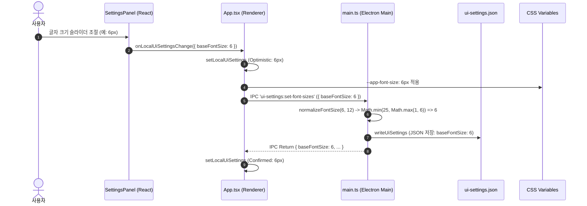

# ADR 0016: UI 설정 동기화 및 폰트 크기 정규화 범위 조정

- 날짜: 2026-08-17
- 상태: Accepted
- 관련 영역: Electron / IPC / State Management / Persistence
- 관련 파일:
  - `frontend/electron/main.ts`
  - `frontend/electron/preload.ts`
  - `frontend/src/components/SettingsPanel.tsx`
  - `frontend/src/components/SettingsPanel.test.tsx`
  - `frontend/src/App.tsx`
  - `frontend/src/styles.css`
  - `%APPDATA%/mileday/ui-settings.json`

---

## 1. 배경 (Context & Problem Statement)

MileDay는 다양한 모니터 해상도와 사용자 선호도(고밀도 정보 선호, 시각적 가독성 선호 등)를 지원하기 위해 설정 패널에서 **기본 글자 크기(`baseFontSize`)**와 **목표 글자 크기(`goalFontSize`)**를 슬라이더로 조절할 수 있는 기능을 제공한다.

기존 기본 범위(10px~32px)에서 더 작고 컴팩트한 위젯 뷰를 원하는 사용자 요구에 맞춰 글자 크기 범위를 **1px~25px**로 확장하기로 결정하였다.

그러나 프론트엔드 UI 컴포넌트(`SettingsPanel.tsx`)의 슬라이더 `min`, `max` 속성을 1~25로 변경했음에도 불구하고 다음과 같은 결함이 지속되었다:
1. 슬라이더를 1~9px로 드래그해도 실제 화면의 폰트 크기가 10px 미만으로 줄어들지 않음.
2. 슬라이더에서 손을 떼거나 설정을 저장하고 앱을 재실행하면 강제로 10px로 원복됨.
3. UI 상에는 값이 바뀌는 것처럼 보이지만 내부 영속화 파일(`ui-settings.json`)에는 여전히 최소 10으로 저장됨.

---

## 2. 원인 분석 (Deep Dive Root Cause Analysis)

문제의 원인은 프론트엔드 렌더러와 일렉트론 메인 프로세스 간의 **다계층 상태 동기화 및 유효성 검증(Clamp) 불일치**에 있었다.

### 2.1 Electron Main Process의 하드코딩된 제한 (`normalizeFontSize`)
`frontend/electron/main.ts`에서 IPC 요청으로 전달된 폰트 크기 및 로컬 JSON 파일에서 읽어온 설정을 파싱할 때 `normalizeFontSize()` 헬퍼를 사용하고 있었다. 이 함수의 구현이 이전 범위인 `10 ~ 32`로 고정되어 있었다.

```typescript
// [기존 main.ts의 하드코딩된 clamp]
function normalizeFontSize(value: unknown, fallback: number): number {
  const parsed = Number(value);
  if (!Number.isFinite(parsed)) {
    return fallback;
  }
  // 10 미만의 값이 전달되면 강제로 10으로 보정됨!
  return Math.min(32, Math.max(10, Math.round(parsed)));
}
```

### 2.2 렌더러 낙관적 업데이트(Optimistic Update)와 IPC 회신 덮어쓰기 레이스
`App.tsx`의 `handleUpdateLocalUiSettings` 함수는 슬라이더 변경 시 즉시 렌더러 로컬 상태(`localUiSettings`)를 갱신하지만, 직후 Electron IPC 호출 결과(`saved`)로 다시 상태를 동기화한다.

```typescript
// frontend/src/App.tsx
async function handleUpdateLocalUiSettings(payload: Partial<LocalUiSettings>) {
  // 1. 렌더러 로컬 state 우선 반영 (예: 5px)
  setLocalUiSettings((prev) => ({ ...prev, ...payload }));

  // 2. Electron Main IPC 호출
  if (payload.baseFontSize !== undefined || payload.goalFontSize !== undefined) {
    const saved = await window.mileday?.uiSettings?.setFontSizes({
      baseFontSize: nextSettings.baseFontSize,
      goalFontSize: nextSettings.goalFontSize,
    });
    // 3. Main process에서 clamp된 값(10px)이 회신되어 5px가 다시 10px로 덮어씌워짐!
    if (saved) {
      setLocalUiSettings(saved);
    }
  }
}
```

### 2.3 빌드 번들(`out/main/main.js`) 미동기화
Electron은 개발 모드(`electron-vite dev`) 또는 패키징 환경에서 `out/main/main.js`에 컴파일된 번들을 실행한다. 소스 코드(`main.ts`)를 수정하더라도 컴파일 빌드가 즉각 수행되지 않으면 Electron은 메모리 상에서 이전 번들의 `normalizeFontSize`를 계속 실행하게 된다.

---

## 3. 해결 방향 및 아키텍처 결정 (Architecture Decisions)



### 원칙 1: 기존 단일 영속화 흐름(Single Source of Truth) 보존
새로운 별도 저장 로직이나 우회 코드를 만들지 않고, 기존의 `SettingsPanel -> App.tsx -> IPC (preload) -> main.ts -> ui-settings.json` 단일 파이프라인을 그대로 유지한다.

### 원칙 2: 전 계층의 유효성 검증 범위 단일화 (1~25px)
1. **UI 계층 (`SettingsPanel.tsx`)**: `<input type="range" min={1} max={25} step={1} />`
2. **백엔드/메인 계층 (`main.ts`)**: `Math.min(25, Math.max(1, Math.round(parsed)))`
3. **타입 및 기본값 계층**: `DEFAULT_LOCAL_UI_SETTINGS` 및 `DEFAULT_UI_SETTINGS`의 정합성 일치.

---

## 4. 상세 구현 내용 (Implementation Details)

### 4.1 `electron/main.ts` 정규화 및 기본값 수정
```typescript
// frontend/electron/main.ts
const DEFAULT_UI_SETTINGS: LocalUiSettings = {
  baseFontSize: 12,
  goalFontSize: 13,
  resizeEnabled: false,
};

function normalizeFontSize(value: unknown, fallback: number): number {
  const parsed = Number(value);
  if (!Number.isFinite(parsed)) {
    return fallback;
  }
  // 1px ~ 25px 범위로 완벽히 정규화
  return Math.min(25, Math.max(1, Math.round(parsed)));
}

function writeUiSettings(settings: LocalUiSettings): LocalUiSettings {
  const normalized = {
    baseFontSize: normalizeFontSize(settings.baseFontSize, DEFAULT_UI_SETTINGS.baseFontSize),
    goalFontSize: normalizeFontSize(settings.goalFontSize, DEFAULT_UI_SETTINGS.goalFontSize),
    resizeEnabled: Boolean(settings.resizeEnabled),
    windowBounds: normalizeWindowBounds(settings.windowBounds),
  };
  writeFileSync(getUiSettingsPath(), JSON.stringify(normalized, null, 2), "utf8");
  return normalized;
}
```

### 4.2 `SettingsPanel.tsx` 슬라이더 및 이벤트 핸들러 정리
```tsx
// frontend/src/components/SettingsPanel.tsx
<label>
  {text.baseFontSize}
  <div style={{ display: "flex", alignItems: "center", gap: "8px" }}>
    <input
      type="range"
      aria-label={text.baseFontSize}
      min={1}
      max={25}
      step={1}
      value={baseFontSize}
      disabled={isLoading}
      onChange={(event) => void handleBaseFontSizeChange(event.target.value)}
      style={{ flex: 1, height: "auto", padding: 0 }}
    />
    <span style={{ fontSize: "11px", fontWeight: 700, width: "32px", textAlign: "right" }}>
      {baseFontSize}px
    </span>
  </div>
</label>
```

### 4.3 `styles.css` CSS 변수 구문 보정
`--app-font-size`에 공백 오타(`10 px`)가 발생하지 않도록 CSS 변수 구문을 엄격히 정돈하여 인라인 스타일 주입 시 즉시 렌더링에 반영되도록 했다.

```css
/* frontend/src/styles.css */
:root {
  --app-font-size: 10px;
  --goal-font-size: 10px;
}
```

---

## 5. 전후 비교 (Before vs After)

| 항목 | 변경 전 (AS-IS) | 변경 후 (TO-BE) |
|---|---|---|
| **UI 슬라이더 min / max** | 10 / 32 (또는 UI만 1~25로 표시) | 1 / 25 완전 통일 |
| **Electron Main Clamp** | `Math.min(32, Math.max(10, ...))` | `Math.min(25, Math.max(1, ...))` |
| **1~9px 입력 시 동작** | 10px로 강제 변경되어 복구됨 | 1~9px 초소형 폰트가 정확히 렌더링 및 저장됨 |
| **`ui-settings.json` 영속화** | 10 미만 값 저장 불가능 | 1~25 사이의 정수 값이 그대로 보존됨 |

---

## 6. 검증 및 결과 (Validation & Impact)

1. **로컬 파일 I/O 검증**:
   - 슬라이더를 1px, 5px, 25px로 각각 조절한 후 `%APPDATA%\mileday\ui-settings.json` 파일을 직접 읽어 JSON 필드가 해당 숫자로 정확히 기록되는지 확인.
2. **IPC 왕복 및 렌더링 검증**:
   - `window.mileday.uiSettings.setFontSizes({ baseFontSize: 5, goalFontSize: 5 })` 호출 시 회신되는 객체가 `{ baseFontSize: 5, goalFontSize: 5 }`임을 확인.
3. **단위 테스트**:
   - `SettingsPanel.test.tsx` 실행을 통해 슬라이더 체인지 이벤트 발생 시 올바른 숫자 페이로드가 상위로 전파되는지 확인 (통과).
