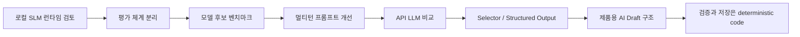

# MileDay ADR Index

이 폴더는 MileDay의 주요 의사결정 기록을 모은다. 단순 파일 목록이 아니라, AI 일정 설계가 어떤 실험과 실패를 거쳐 현재 제품 구조로 좁혀졌는지 확인하기 위한 인덱스다.

## AI 설계 흐름 요약



초기 ADR은 Ollama 기반 로컬 SLM을 전제로 모델 실행과 평가 체계를 정리했다. 이후 공개 benchmark와 MileDay 자체 멀티턴 테스트를 거치며, 모델이 DB payload와 날짜 계산을 직접 책임질 때 JSON 필드 누락, 날짜/요일 불일치, slot 환각, 부분 수정 범위 오류가 반복됨을 확인했다.

현재 제품 코드의 원칙은 더 좁다. LLM은 자연어 목표를 해석해 편집 가능한 일정 초안을 만들고, 저장 가능한 payload 구성, validation, persistence는 애플리케이션 코드가 책임진다. 이 방향은 [0014-AI_일정_생성_UI_구현_계획.md](0014-AI_일정_생성_UI_구현_계획.md)와 현재 `backend/app/services/ai_schedule_service.py` 구현에 반영돼 있다.

## 핵심 결정

### 로컬 런타임과 평가

- [0001-Ollama_런타임_도입.md](0001-Ollama_런타임_도입.md): 초기 로컬 LLM 실행 환경으로 Ollama를 채택했다.
- [0002-평가_체계_분리.md](0002-평가_체계_분리.md): 공식 평가와 생성 평가를 분리해 모델 비교와 제품형 생성 평가를 따로 본다.
- [0003-모델_출력_보존.md](0003-모델_출력_보존.md): 실패 분석과 재현을 위해 원본 모델 출력을 보존한다.
- [0004-일정_검증_규칙.md](0004-일정_검증_규칙.md): 일정 결과는 LLM 판단만 믿지 않고 결정적 규칙으로 검증한다.
- [0005-BMAD_Lite_적용.md](0005-BMAD_Lite_적용.md): Codex 작업 하네스에 BMAD Lite를 적용한 기록이다.

### 모델 평가

- [0006-모델_평가_후보_선정.md](0006-모델_평가_후보_선정.md): 1차 smoke, 공개 benchmark, 3차 정밀 비교를 거쳐 로컬 후보를 좁혔다. 최종 로컬 후보는 `candidate-3`인 `granite4.1:3b`였지만, 제품용 멀티턴 일정 수정에는 추가 안정화가 필요하다고 판단했다.
- [0011-API_LLM_선정.md](0011-API_LLM_선정.md): API LLM은 비용과 지연을 고려해 `gemini-3.5-flash-lite`를 기본 모델로 선택했다. `gemini-3.6-flash`는 품질이 더 높았지만 비용과 latency 차이가 컸고, 주요 실패는 parser/validator 개선 대상으로 남았다.
- [0022-최종_AI_초안_모델_재평가.md](0022-최종_AI_초안_모델_재평가.md): 최종 제품 기능인 편집 가능한 일정 초안 기준으로 Local SLM과 Gemini Flash Lite를 다시 비교했다.

모델 평가는 단일 score만 보지 않는다. parser error, failure, latency, TTFT, tokens/sec, deterministic validation, judge score, critical failure를 함께 봐야 제품 적용 가능성을 판단할 수 있다.

### Prompt / System Design 변화

- [0007-멀티턴_프롬프트_1차.md](0007-멀티턴_프롬프트_1차.md): 멀티턴 프롬프트를 버전으로 관리하고, 필수 field와 create/partial_update 기준을 강화했다.
- [0008-멀티턴_프롬프트_2차.md](0008-멀티턴_프롬프트_2차.md): DB payload 직접 생성에서 slot 기반 PLAN/PATCH, 이후 의도 해석 중심 구조로 옮겨 간 과정을 기록한다.
- [0009-멀티턴_테스트셋_설계.md](0009-멀티턴_테스트셋_설계.md): 30개 case, 90개 turn 기준의 멀티턴 자체 테스트셋을 설계했다. 상태 보존, 부분 수정, 불가능한 요청, 사용자 승인 전 DB 반영 차단을 Safety Gate로 본다.
- [0010-API_프롬프트_개선.md](0010-API_프롬프트_개선.md): API 전용 `v12-api` 프롬프트와 강화된 judge 기준을 도입했다.
- [0012-Selector_규칙_도입.md](0012-Selector_규칙_도입.md): parser가 자연어를 직접 계속 해석하지 않고, LLM이 구조화한 selector를 검증하도록 책임을 재배치했다.
- [0013-구조화_출력_프롬프트.md](0013-구조화_출력_프롬프트.md): Gemini Structured Output, selector contract, 짧은 self-check 중심의 prompt 개선 순서를 정리했다.

설계 변화의 핵심은 `모델이 DB payload까지 직접 생성`하던 방식에서 `모델은 의도/초안 생성, 코드는 검증과 payload 생성`으로 책임을 줄인 것이다.

## 제품 AI Draft 구조

[0014-AI_일정_생성_UI_구현_계획.md](0014-AI_일정_생성_UI_구현_계획.md)는 평가 하네스의 멀티턴 수정 구조를 실제 제품 MVP에 맞게 단순화했다.

현재 제품 흐름:

```text
자연어 요청
-> Gemini Structured Output
-> 서버 JSON parsing
-> deadline, availability, duplicate, preference validation
-> Goal + Milestone editable draft
-> 사용자 수정/선택/삭제/추가
-> 기존 Goal/Milestone API 저장
```

이 흐름에서 AI는 Supabase에 접근하지 않고, `goal_id`, `milestone_id`, SQL, DB mutation을 만들지 않는다. 사용자가 확인하기 전 실제 DB write도 수행하지 않는다.

## UI / Desktop / Reliability 결정

- [0015-목표_편집_및_위젯_레이아웃_개선.md](0015-목표_편집_및_위젯_레이아웃_개선.md): 목표 편집 권한을 날짜 종속이 아니라 목표 소유권 기준으로 정리하고 floating panel 레이아웃을 도입했다.
- [0016-UI_글자_크기_설정_동기화.md](0016-UI_글자_크기_설정_동기화.md): Electron main process, 설정 UI, CSS 변수의 글자 크기 범위를 맞췄다.
- [0017-개발_환경_GPU_샌드박스_및_Watch_설정.md](0017-개발_환경_GPU_샌드박스_및_Watch_설정.md): Electron 개발 실행에서 GPU sandbox crash를 피하고 main/preload watch를 적용했다.
- [0018-인증_예외_세분화_및_AI_색상_동기화.md](0018-인증_예외_세분화_및_AI_색상_동기화.md): 이메일 미인증 오류와 일반 로그인 실패를 분리하고, AI 일정 초안의 목표/마일스톤 색상 일관성을 보정했다.
- [0019-메인_레이아웃_전체_스크롤_및_팝업_수정.md](0019-메인_레이아웃_전체_스크롤_및_팝업_수정.md): 전체 스크롤 구조와 quick menu clipping 문제를 정리했다.
- [0020-물리_화면_대응_크기_조정_및_중복_정리.md](0020-물리_화면_대응_크기_조정_및_중복_정리.md): 노트북 화면, Windows 배율, 작은 창에 대응하는 크기 정책을 정리했다.
- [0021-전체_목표_조회_및_완료_처리_최적화.md](0021-전체_목표_조회_및_완료_처리_최적화.md): 전체 목표 통합 조회 API와 완료 처리 RPC로 순차 조회 비용과 완료 동기화 문제를 줄였다.
- [0023-RLS_service_role_보안_구조_검증.md](0023-RLS_service_role_보안_구조_검증.md): service role 사용 구조에서 사용자 데이터 분리의 핵심 방어선을 backend `user_id` 조건으로 정리했다.

## ADR 목록

| ADR | Topic | Status / Summary |
|---|---|---|
| [0001](0001-Ollama_런타임_도입.md) | Ollama Runtime | Accepted. 로컬 LLM 실행 기반으로 Ollama를 선택 |
| [0002](0002-평가_체계_분리.md) | Evaluation Separation | Accepted. 공식 benchmark와 생성 평가를 분리 |
| [0003](0003-모델_출력_보존.md) | Raw Output Preservation | Accepted. 실패 분석을 위해 원본 모델 출력 보존 |
| [0004](0004-일정_검증_규칙.md) | Deterministic Validation | Accepted. 일정 제약은 코드 검증으로 확인 |
| [0005](0005-BMAD_Lite_적용.md) | BMAD Lite | Accepted. Codex 하네스 작업 방식 기록 |
| [0006](0006-모델_평가_후보_선정.md) | Model Candidate Benchmark | Accepted. `granite4.1:3b`를 로컬 후보로 압축 |
| [0007](0007-멀티턴_프롬프트_1차.md) | Multiturn Prompt v1-v3 | Accepted. 필수 field와 partial update 기준 강화 |
| [0008](0008-멀티턴_프롬프트_2차.md) | Multiturn Prompt v1-v11 | Accepted. slot/PLAN/PATCH를 거쳐 의도 해석 중심으로 축소 |
| [0009](0009-멀티턴_테스트셋_설계.md) | Multiturn Testset | Draft. 30개 case와 Safety Gate 기준 설계 |
| [0010](0010-API_프롬프트_개선.md) | API Prompt | Accepted. API 전용 prompt와 judge 기준 강화 |
| [0011](0011-API_LLM_선정.md) | API LLM | Accepted. 기본 API 모델로 `gemini-3.5-flash-lite` 선택 |
| [0012](0012-Selector_규칙_도입.md) | Selector Contract | Accepted. selector resolution 중심 parser 구조 도입 |
| [0013](0013-구조화_출력_프롬프트.md) | Structured Output | Accepted. Gemini response schema와 self-check 중심 개선 계획 |
| [0014](0014-AI_일정_생성_UI_구현_계획.md) | Product AI Draft | 구현 계획. 제품 MVP에서는 AI를 초안 생성으로 제한 |
| [0015](0015-목표_편집_및_위젯_레이아웃_개선.md) | Goal Editing / Layout | 날짜 종속 편집과 작은 위젯 레이아웃 개선 |
| [0016](0016-UI_글자_크기_설정_동기화.md) | UI Font Settings | 글자 크기 설정 범위와 저장 흐름 동기화 |
| [0017](0017-개발_환경_GPU_샌드박스_및_Watch_설정.md) | Dev Runtime | Electron GPU sandbox와 watch 실행 문제 해결 |
| [0018](0018-인증_예외_세분화_및_AI_색상_동기화.md) | Auth / AI Color | 인증 예외 세분화와 AI 초안 색상 동기화 |
| [0019](0019-메인_레이아웃_전체_스크롤_및_팝업_수정.md) | Layout Scroll / Popup | 메인 스크롤과 quick menu 표시 안정화 |
| [0020](0020-물리_화면_대응_크기_조정_및_중복_정리.md) | Responsive Sizing | 화면 크기 대응과 중복 정의 정리 |
| [0021](0021-전체_목표_조회_및_완료_처리_최적화.md) | Goal Query Optimization | 통합 조회 API와 완료 처리 RPC로 성능 개선 |
| [0022](0022-최종_AI_초안_모델_재평가.md) | Final AI Draft Model Evaluation | Measured once. 최종 초안 기능 기준 SLM/API 1차 자동 측정 |
| [0023](0023-RLS_service_role_보안_구조_검증.md) | RLS / Service Role Security | Accepted. 사용자 데이터 분리 방어선 재정의 |
