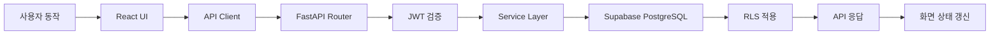
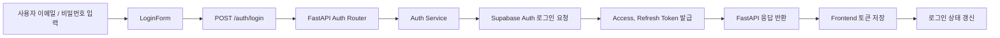
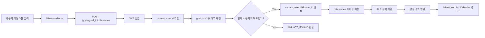
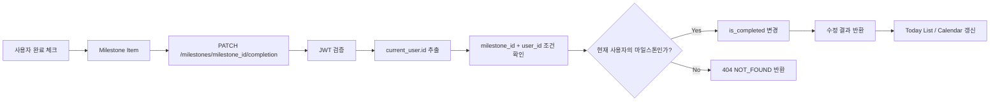
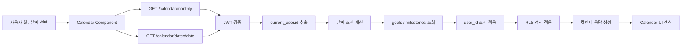
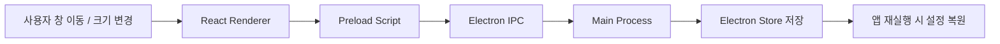
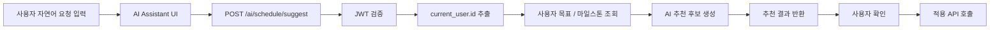

# MileDay Data Flow

이 문서는 기능별 데이터 흐름을 구현 단계에서 확인하기 위한 문서임

`codex_rules.md`는 작업 규칙을 압축한 문서이고, 이 문서는 실제 기능이 어떤 순서로 이동하는지 확인하는 보조 문서로 사용함

## 기본 원칙

- Frontend는 Supabase에 직접 접근하지 않음
- 모든 데이터 요청은 FastAPI API를 통해 처리함
- 인증 기준은 Supabase Auth JWT를 사용함
- FastAPI는 JWT를 검증하고 `sub` 값을 `current_user.id`로 사용함
- `user_id`는 클라이언트 값을 신뢰하지 않고 서버에서 직접 설정함
- DB 접근은 `user_id` 조건과 Supabase RLS를 함께 사용함
- PC 환경 종속 값은 DB가 아니라 Electron Store에 저장함

## 기능별 데이터 흐름 대상

| 구분 | 주요 기능 | 주요 데이터 | API / 저장 위치 |
| --- | --- | --- | --- |
| Auth | 회원가입, 로그인, 현재 사용자 확인 | access_token, refresh_token, user_id | `/auth`, Supabase Auth |
| Goal | 목표 생성, 조회, 수정, 삭제 | goals | `/goals`, goals |
| Milestone | 마일스톤 생성, 조회, 완료 처리 | milestones | `/milestones`, milestones |
| Calendar | 월간 캘린더, 날짜 상세, Today List 조회 | goals, milestones.scheduled_date | `/calendar` |
| Settings | 사용자 설정 조회, 수정 | user_settings | `/settings`, user_settings |
| Widget Local | 창 위치, 크기, 항상 위, 자동 실행 | local widget settings | Electron Store |
| Future | 외부 캘린더, AI 일정 도우미 | external connections, AI suggestions | `/external-calendars`, `/ai` |

## 공통 흐름



## 로그인 흐름



- 인증 제공자는 Supabase Auth임
- Access Token은 인증이 필요한 API 요청의 Authorization Header에 사용함
- 사용자 식별 기준은 JWT의 `sub` 값임
- 로그인 이후 API 요청은 `Authorization: Bearer <access_token>` 형식을 사용함

## 인증 API 요청 흐름

```mermaid
flowchart LR
    A[Frontend API 요청] --> B[Authorization Header 포함]
    B --> C[FastAPI]
    C --> D[JWT 추출]
    D --> E[JWT 검증]
    E --> F[current_user.id 추출]
    F --> G[Service Layer 전달]
    G --> H[user_id 기준 데이터 처리]
    H --> I[Supabase PostgreSQL 요청]
    I --> J[RLS 정책 적용]
    J --> K[결과 반환]
```



| 상황 | 처리 |
| --- | --- |
| Authorization Header 없음 | 401 UNAUTHORIZED |
| JWT 형식 오류 | 401 UNAUTHORIZED |
| JWT 만료 | 401 TOKEN_EXPIRED |
| JWT 검증 실패 | 401 INVALID_TOKEN |
| 서버 내부 오류 | 500 INTERNAL_SERVER_ERROR |

## 목표 생성 흐름

```mermaid
flowchart LR
    A[사용자 목표 입력] --> B[GoalForm]
    B --> C[API Client]
    C --> D[POST /goals]
    D --> E[FastAPI Goal Router]
    E --> F[JWT 검증]
    F --> G[current_user.id 추출]
    G --> H[Request Body 검증]
    H --> I[Goal Service]
    I --> J[goals 테이블 저장]
    J --> K[RLS 정책 적용]
    K --> L[생성 결과 반환]
    L --> M[Goal List / Calendar 갱신]
```



- 호출 API는 `POST /goals`임
- 저장 테이블은 `goals`임
- `user_id`는 `current_user.id`를 서버에서 설정함
- 주요 입력값은 `title`, `deadline`, `is_recurring`, `recurrence_type`, `color`임
- FE는 `user_id`를 보내지 않거나, 보내더라도 BE는 사용하지 않음

## 목표 조회, 수정, 삭제 흐름

```mermaid
flowchart LR
    A[Frontend 목표 RUD 요청] --> B[/goals/goal_id]
    B --> C[JWT 검증]
    C --> D[current_user.id 추출]
    D --> E[goal_id + user_id 조건 조회]
    E --> F{현재 사용자의 목표인가?}
    F -- Yes --> G[조회 / 수정 / 삭제 처리]
    F -- No --> H[404 NOT_FOUND 반환]
    G --> I[결과 반환]
    I --> J[화면 상태 갱신]
```

| 동작 | API | 처리 기준 |
| --- | --- | --- |
| 목표 목록 조회 | `GET /goals` | `goals.user_id = current_user.id` |
| 목표 상세 조회 | `GET /goals/{goal_id}` | `id = goal_id AND user_id = current_user.id` |
| 목표 수정 | `PATCH /goals/{goal_id}` | `id = goal_id AND user_id = current_user.id` |
| 목표 삭제 | `DELETE /goals/{goal_id}` | `id = goal_id AND user_id = current_user.id` |

권한이 없거나 존재하지 않는 목표는 데이터 존재 여부를 노출하지 않기 위해 `404 NOT_FOUND`로 처리함

## 마일스톤 생성 흐름



- 호출 API는 `POST /goals/{goal_id}/milestones`임
- 저장 테이블은 `milestones`임
- 생성 전 `goal_id`가 현재 사용자의 목표인지 확인함
- `milestones.user_id`는 `current_user.id`로 설정함
- 주요 입력값은 `title`, `color`, `scheduled_date`임

## 마일스톤 완료 처리 흐름



| 동작 | API | 처리 기준 |
| --- | --- | --- |
| 마일스톤 상세 조회 | `GET /milestones/{milestone_id}` | `id = milestone_id AND user_id = current_user.id` |
| 마일스톤 수정 | `PATCH /milestones/{milestone_id}` | `id = milestone_id AND user_id = current_user.id` |
| 완료 여부 변경 | `PATCH /milestones/{milestone_id}/completion` | `id = milestone_id AND user_id = current_user.id` |
| 마일스톤 삭제 | `DELETE /milestones/{milestone_id}` | `id = milestone_id AND user_id = current_user.id` |

## 캘린더 조회 흐름



| 동작 | API | 처리 기준 |
| --- | --- | --- |
| 월간 캘린더 조회 | `GET /calendar/monthly?year={year}&month={month}` | user_id + year + month |
| 주간 캘린더 조회 | `GET /calendar/weekly?start_date={start_date}` | user_id + start_date |
| 날짜 상세 조회 | `GET /calendar/dates/{date}` | user_id + date |
| 오늘 할 일 조회 | `GET /calendar/today` | user_id + today |

캘린더 조회에서는 `milestones.scheduled_date`를 기준으로 날짜별 작업을 묶음

## 사용자 설정 흐름

```mermaid
flowchart LR
    A[사용자 설정 화면 진입] --> B[Settings Page]
    B --> C[GET /settings]
    C --> D[JWT 검증]
    D --> E[current_user.id 추출]
    E --> F[user_settings 조회]
    F --> G[설정 값 반환]
    G --> H[설정 화면 표시]
    H --> I[사용자 설정 변경]
    I --> J[PATCH /settings]
    J --> K[user_settings 수정]
    K --> L[수정 결과 반환]
```



- 사용자 설정은 `user_settings` 테이블에서 관리함
- 사용자 1명당 설정 row는 1개만 필요하므로 `user_id`를 기준으로 조회하고 수정함
- 설정이 없으면 기본값 응답 또는 기본 row 생성 기준을 명확히 유지함

## 로컬 위젯 설정 흐름



로컬 저장 대상:

- `window_x`
- `window_y`
- `window_width`
- `window_height`
- `always_on_top`
- `opacity`
- `launch_on_startup`
- `last_selected_date`
- `last_opened_month`
- `sidebar_collapsed`
- `widget_layout`

## Future 흐름

외부 캘린더 연동과 AI 일정 도우미는 MVP 이후 기능으로 분리함



AI API는 바로 DB를 수정하지 않고 추천 결과나 변경 후보를 반환한 뒤 사용자 확인을 받는 방식으로 처리함

## 구현 전 확인 사항

- Calendar endpoint는 `api_spec.md`와 맞춰 `/calendar/monthly`, `/calendar/weekly`, `/calendar/dates/{date}`, `/calendar/today` 기준을 사용함
- Milestone 완료 처리 endpoint는 `/milestones/{milestone_id}/completion` 기준을 사용함
- 외부 캘린더 endpoint는 `/external-calendars` 기준을 사용함
- 기존 코드에 `calender`, `external-calender` 같은 오타성 이름이 있으면 새 코드에서 확산하지 않음
- 현재 라우터가 mock 응답 중심이면 실제 구현 시 Service Layer 분리를 우선함
- 모든 보호 API에서 JWT 검증 dependency를 적용함
- `goals`, `milestones`, `user_settings`, `external_calendar_connections`에는 `auth.uid() = user_id` 기준 RLS를 적용함

