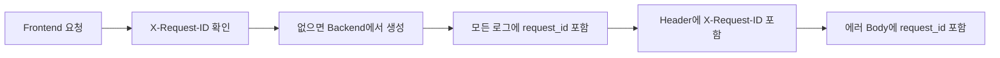
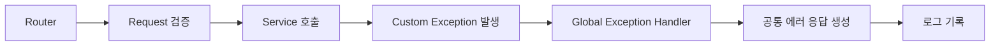

# MileDay Error And Logging

이 문서는 예외 처리와 로그 설계를 구현 단계에서 확인하기 위한 문서임

`codex_rules.md`는 공통 규칙을 압축한 문서이고, 이 문서는 실제 예외 코드, 응답 형식, 로그 포함 정보, 마스킹 기준을 확인하는 보조 문서로 사용함

## 설계 목적

- API 오류를 일관된 형식으로 반환함
- 문제 발생 시 원인을 빠르게 추적할 수 있도록 함
- Frontend, FastAPI Backend, Supabase, Electron 로컬 환경 오류를 같은 기준으로 분류함
- 사용자에게 보여줄 메시지와 개발자가 확인할 로그 정보를 분리함

## 기본 방향

| 항목 | 기준 |
| --- | --- |
| 에러 응답 형식 | 공통 JSON 구조로 통일함 |
| 입력값 검증 실패 | 400 BAD_REQUEST로 통일함 |
| 권한 없는 데이터 접근 | 404 NOT_FOUND로 숨김 처리함 |
| 에러 메시지 표시 | Frontend에서 `error.code` 기준으로 매핑함 |
| 예외 처리 구조 | Custom Exception을 던지고 Global Handler에서 응답으로 변환함 |
| 로그 저장 | 콘솔과 파일 로그를 함께 사용함 |
| request_id | 모든 요청, 응답, 로그에 포함함 |
| user_id | 로그에 남기되 이메일, 토큰, 비밀번호는 제외함 |
| 요청 body | 에러 상황에서만 민감값 마스킹 후 기록함 |
| 성공 로그 | 큰 단위 이벤트 중심으로만 기록함 |
| Future 기능 | 외부 캘린더와 AI 예외도 기준만 포함함 |

## 구현 체크리스트

| 구분 | 내용 |
| --- | --- |
| Backend 공통 | request_id Middleware 구현함 |
| Backend 공통 | 공통 ErrorResponse schema 정의함 |
| 예외 처리 | MileDayBaseException 정의함 |
| 예외 처리 | 기능별 Custom Exception 정의함 |
| 예외 처리 | Global Exception Handler 구현함 |
| 예외 처리 | FastAPI Validation Error를 400으로 변환함 |
| 로그 | 로그 formatter에 request_id, user_id, path, duration_ms 포함함 |
| 로그 | 요청 body 마스킹 유틸 구현함 |
| 로그 | 콘솔 + 파일 로그 설정함 |
| 로그 | 파일 로그 날짜별 회전과 7일 보관 설정함 |
| Electron | Electron 로컬 로그 저장 기준 정의함 |
| Frontend | Frontend error.code 메시지 매핑 테이블 작성함 |

## 공통 에러 응답

```json
{
  "success": false,
  "error": {
    "code": "GOAL_CREATE_FAILED",
    "message": "목표를 생성하지 못했습니다",
    "detail": "Goal insert failed"
  },
  "request_id": "req_20260705_abcd1234"
}
```

| 필드 | 설명 |
| --- | --- |
| success | 실패 시 `false`로 고정함 |
| error.code | Frontend에서 메시지와 UI 처리를 매핑하기 위한 코드 |
| error.message | 기본 사용자 안내 메시지 |
| error.detail | 개발자 확인용 상세 원인 |
| request_id | 요청 추적을 위한 고유 ID |

운영 환경에서도 `detail`을 내려주되 비밀번호, 토큰, 내부 SQL, stack trace 같은 민감 정보는 포함하지 않음

## HTTP Status 기준

| 상황 | Status | 처리 기준 |
| --- | --- | --- |
| 입력값 누락 / 잘못된 입력 | 400 BAD_REQUEST | FastAPI 기본 422 대신 400으로 통일함 |
| 로그인 필요 | 401 UNAUTHORIZED | Authorization Header가 없거나 유효하지 않은 경우 |
| JWT 만료 | 401 UNAUTHORIZED | 토큰 만료도 인증 실패로 처리함 |
| 다른 사용자 데이터 접근 | 404 NOT_FOUND | 데이터 존재 여부를 숨기기 위해 404로 처리함 |
| 리소스 없음 | 404 NOT_FOUND | 현재 사용자 기준으로 조회되지 않는 경우 |
| 중복 데이터 | 409 CONFLICT | 이메일 중복, 외부 계정 중복 연결 등 |
| Supabase Auth 실패 | 502 BAD_GATEWAY | 외부 인증 서비스 응답 실패로 처리함 |
| 외부 캘린더 API 장애 | 502 BAD_GATEWAY 또는 503 SERVICE_UNAVAILABLE | 외부 서비스 상태에 따라 분리함 |
| 서버 내부 오류 | 500 INTERNAL_SERVER_ERROR | 예상하지 못한 서버 오류 |

`403 FORBIDDEN`은 데이터가 존재하지만 접근 권한이 없다는 의미를 노출할 수 있으므로 사용자 개인 데이터 접근 실패에는 사용하지 않음

## 에러 코드 네이밍

- 대문자 스네이크 케이스를 사용함
- 기능별 prefix를 붙여 에러 발생 영역을 바로 파악할 수 있도록 함
- 예시는 `AUTH_INVALID_TOKEN`, `GOAL_NOT_FOUND`, `MILESTONE_CREATE_FAILED`, `CALENDAR_INVALID_DATE`, `SETTINGS_UPDATE_FAILED` 형식임

## request_id 기준



| 항목 | 기준 |
| --- | --- |
| 생성 위치 | 요청 진입 시 Middleware에서 생성함 |
| Header | `X-Request-ID`로 반환함 |
| Body | 에러 응답에는 request_id를 포함함 |
| 로그 | 모든 로그에 request_id를 포함함 |
| 클라이언트 전달값 | 클라이언트가 보낸 X-Request-ID가 있으면 재사용할 수 있음 |

## 로그 레벨

| 레벨 | 상황 |
| --- | --- |
| INFO | 서버 시작, 서버 종료, 로그인 성공, 주요 생성/수정 성공, 배치성 동기화 완료 |
| WARNING | 로그인 실패, JWT 검증 실패, 권한 없는 데이터 접근 시도, 잘못된 입력 반복 |
| ERROR | DB 저장 실패, Supabase 요청 실패, 외부 캘린더 API 실패, AI Provider 실패 |
| CRITICAL | 서버 부팅 실패, 필수 환경 변수 누락, DB 연결 불가 |

성공 로그 기록 대상:

| 이벤트 | 기록 여부 |
| --- | --- |
| 서버 시작 | 기록함 |
| 로그인 성공 | 기록함 |
| 목표 생성 성공 | 기록함 |
| 마일스톤 생성 성공 | 기록함 |
| 사용자 설정 수정 성공 | 기록함 |
| 단순 조회 성공 | 기록하지 않음 |
| 캘린더 조회 성공 | 기본적으로 기록하지 않음 |

## 로그 포함 정보

Backend 로그에는 요청 추적과 오류 분석에 필요한 최소 정보를 남김

- `timestamp`
- `level`
- `request_id`
- `method`
- `path`
- `status_code`
- `user_id`
- `error_code`
- `message`
- `duration_ms`

로그에 남기지 않는 정보:

- `password`
- `access_token`
- `refresh_token`
- Authorization Header 원문
- 외부 캘린더 토큰
- AI 요청 원문 전체

## 요청 Body 로그 기준

요청 body는 기본적으로 로그에 남기지 않음

에러 분석에 필요한 경우에만 민감값을 제거하거나 마스킹한 뒤 기록함

| 원본 필드 | 로그 기록 값 |
| --- | --- |
| password | `[MASKED]` |
| access_token | `[MASKED]` |
| refresh_token | `[MASKED]` |
| authorization | `[MASKED]` |
| email | `no***@gmail.com` |
| external_access_token | `[MASKED]` |
| external_refresh_token | `[MASKED]` |
| ai_prompt | `[OMITTED]` |

## 로그 저장 위치

| 환경 | 저장 방식 |
| --- | --- |
| development | 콘솔 로그 중심으로 확인함 |
| production server | 콘솔 + 파일 로그를 함께 남김 |
| Electron local app | 사용자 PC에 로컬 앱 로그를 남김 |

파일 로그 기준:

- 날짜별로 분리함
- 최근 7일 보관을 기본으로 함
- 일정 용량 초과 시 회전 처리함
- 민감 정보는 저장하지 않거나 마스킹함

Electron 로컬 로그 기준:

- 사용자 PC에도 최근 7일 기준 로컬 앱 로그를 남김
- 네트워크 연결 실패, API Base URL 설정 오류, 토큰 저장 실패, Electron Store 저장 실패, Frontend 예외를 확인하기 위함
- 로컬 로그에도 민감 정보는 저장하지 않음

## Frontend 에러 표시 기준

Frontend는 `error.code` 기준으로 사용자 메시지를 매핑함

| 상황 | 표시 방식 |
| --- | --- |
| 입력값 오류 | 각 input 아래 메시지로 표시함 |
| 목표 생성 실패 | Toast로 표시함 |
| 마일스톤 수정 실패 | Toast로 표시함 |
| 인증 만료 | 로그인 화면으로 이동함 |
| 서버 장애 | Toast 또는 상단 배너로 표시함 |
| 외부 캘린더 연동 실패 | 설정 화면 안에서 상태로 표시함 |
| AI 추천 실패 | AI 입력 영역 안에서 재시도 안내를 표시함 |

## FastAPI 예외 처리 구조



| 계층 | 역할 |
| --- | --- |
| Router | Path, Query, Body 입력값을 받고 Service를 호출함 |
| Service | 비즈니스 규칙, 권한 기준, 데이터 소유 여부를 검증함 |
| Repository / Infra | Supabase 요청과 외부 서비스 요청을 처리함 |
| Global Handler | Custom Exception을 HTTP 응답으로 변환하고 로그를 남김 |
| Middleware | request_id 생성, 요청 시간 측정, 공통 로그 context를 관리함 |

예외 처리 예시:

- `GoalNotFoundError`
- `GoalCreateFailedError`
- `MilestoneNotFoundError`
- `SettingsUpdateFailedError`
- `ExternalCalendarSyncFailedError`
- `AiProviderFailedError`

## Supabase 오류 매핑

| Supabase 상황 | MileDay 에러 코드 | Status |
| --- | --- | --- |
| 로그인 실패 | `AUTH_INVALID_CREDENTIALS` | 401 |
| JWT 검증 실패 | `AUTH_INVALID_TOKEN` | 401 |
| JWT 만료 | `AUTH_TOKEN_EXPIRED` | 401 |
| DB 연결 실패 | `SUPABASE_UNAVAILABLE` | 502 |
| unique constraint 실패 | `DUPLICATE_RESOURCE` | 409 |
| RLS로 조회 결과 없음 | `NOT_FOUND` | 404 |
| 예상하지 못한 Supabase 오류 | `SUPABASE_REQUEST_FAILED` | 502 |

Supabase 원본 오류 메시지를 그대로 사용자에게 노출하지 않고 내부 detail에 필요한 수준으로만 정리해서 포함함

## 보안 로그 기준

| 이벤트 | 로그 레벨 | 설명 |
| --- | --- | --- |
| AUTH_LOGIN_FAILED | WARNING | 로그인 실패 |
| AUTH_INVALID_TOKEN | WARNING | 유효하지 않은 JWT 사용 |
| AUTH_TOKEN_EXPIRED | INFO 또는 WARNING | 토큰 만료 |
| UNAUTHORIZED_RESOURCE_ACCESS | WARNING | 다른 사용자 데이터 접근 시도 |
| RLS_ACCESS_DENIED | WARNING | DB 레벨 접근 제한 발생 |
| EXTERNAL_CALENDAR_TOKEN_ERROR | ERROR | 외부 캘린더 토큰 오류 |

Authorization Header 원문, access_token, refresh_token은 어떤 경우에도 로그에 저장하지 않음

## 환경별 노출 기준

| 환경 | 응답 detail | 로그 stack trace |
| --- | --- | --- |
| development | detail 포함함 | 콘솔과 파일에 기록함 |
| production | 안전한 detail만 포함함 | 파일 로그에 기록함 |

운영 환경에서는 SQL 문장, token 원문, stack trace를 응답에 포함하지 않음

## 기능별 예외 코드

### Auth

| 코드 | 설명 | Status |
| --- | --- | --- |
| AUTH_INVALID_CREDENTIALS | 이메일 또는 비밀번호 불일치 | 401 |
| AUTH_TOKEN_EXPIRED | Access Token 만료 | 401 |
| AUTH_INVALID_TOKEN | JWT 검증 실패 | 401 |
| AUTH_USER_NOT_FOUND | 사용자 정보 없음 | 404 |
| AUTH_LOGOUT_FAILED | 로그아웃 처리 실패 | 500 |

### Goal

| 코드 | 설명 | Status |
| --- | --- | --- |
| GOAL_NOT_FOUND | 현재 사용자 기준 목표 없음 | 404 |
| GOAL_CREATE_FAILED | 목표 생성 실패 | 500 |
| GOAL_UPDATE_FAILED | 목표 수정 실패 | 500 |
| GOAL_DELETE_FAILED | 목표 삭제 실패 | 500 |
| GOAL_INVALID_DEADLINE | 잘못된 목표 마감일 | 400 |

### Milestone

| 코드 | 설명 | Status |
| --- | --- | --- |
| MILESTONE_NOT_FOUND | 현재 사용자 기준 마일스톤 없음 | 404 |
| MILESTONE_CREATE_FAILED | 마일스톤 생성 실패 | 500 |
| MILESTONE_UPDATE_FAILED | 마일스톤 수정 실패 | 500 |
| MILESTONE_DELETE_FAILED | 마일스톤 삭제 실패 | 500 |
| MILESTONE_INVALID_SCHEDULED_DATE | 잘못된 수행 예정일 | 400 |

### Calendar

| 코드 | 설명 | Status |
| --- | --- | --- |
| CALENDAR_INVALID_MONTH | 잘못된 월 조회 조건 | 400 |
| CALENDAR_INVALID_DATE | 잘못된 날짜 형식 | 400 |
| CALENDAR_QUERY_FAILED | 캘린더 조회 실패 | 500 |

### Settings

| 코드 | 설명 | Status |
| --- | --- | --- |
| SETTINGS_NOT_FOUND | 사용자 설정 없음 | 404 |
| SETTINGS_UPDATE_FAILED | 사용자 설정 수정 실패 | 500 |
| SETTINGS_INVALID_VALUE | 잘못된 설정 값 | 400 |

### Future

| 코드 | 설명 | Status |
| --- | --- | --- |
| EXTERNAL_CALENDAR_PROVIDER_UNSUPPORTED | 지원하지 않는 외부 캘린더 Provider | 400 |
| EXTERNAL_CALENDAR_AUTH_FAILED | 외부 캘린더 인증 실패 | 401 |
| EXTERNAL_CALENDAR_SYNC_FAILED | 외부 캘린더 동기화 실패 | 502 |
| EXTERNAL_CALENDAR_TOKEN_ERROR | 외부 캘린더 토큰 오류 | 502 |
| AI_REQUEST_INVALID | 잘못된 AI 요청 | 400 |
| AI_PROVIDER_FAILED | AI Provider 응답 실패 | 502 |
| AI_SUGGESTION_FAILED | AI 추천 생성 실패 | 500 |
| AI_RESULT_REQUIRES_CONFIRMATION | 사용자 확인이 필요한 추천 결과 | 200 또는 409 |

